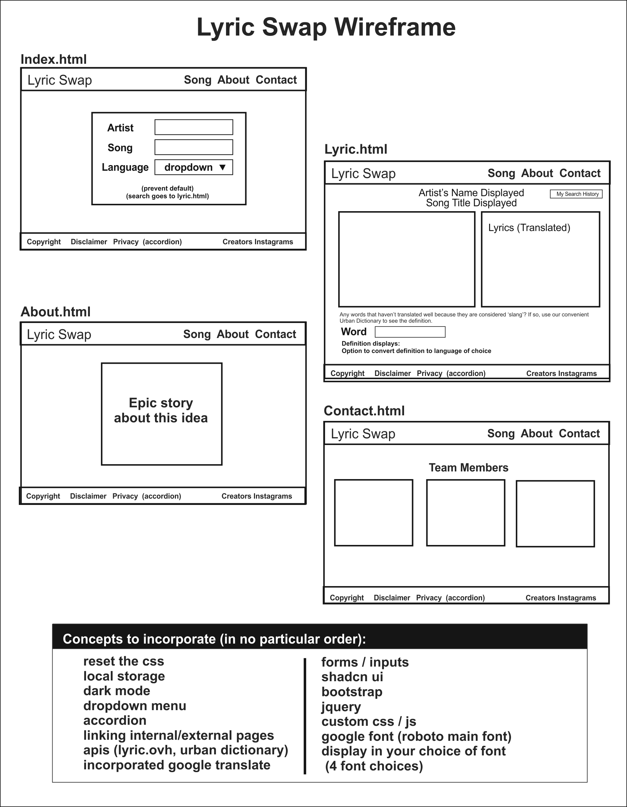

# Lyrics Swap

[Live Page](https://lukemaines.github.io/lyric-swap/)

## Overview

Lyrics Swap is a web application designed to provide users with song lyrics and their translations. The application allows users to search for lyrics by song title and artist, store their search history, and view translated lyrics in multiple languages. This project utilizes various web technologies including HTML, CSS, JavaScript, jQuery, and APIs.

## Features

- **Search Lyrics**: Search for lyrics by entering the artist's name and song title.
- **Lyrics History**: Store and view your lyrics search history.
- **Translate Lyrics**: Translate lyrics into multiple languages using the Deep Translate API.
- **Urban Dictionary Integration**: Find definitions for tricky words using the Urban Dictionary API.
- **Responsive Design**: Optimized for both desktop and mobile viewing.

## Project Structure

|-- index.html
|-- about.html
|-- contact.html
|-- lyrics.html
|-- style.css
|-- script.js




### index.html

The main landing page for Lyrics Swap. It contains search functionalities for lyrics and definitions, translation options, and navigation links to other pages.

### about.html

A page providing information about the application and the developers.

### contact.html

A contact page where users can find information on how to get in touch with the developers.

### lyrics.html

A page displaying the user's lyrics search history. Users can click on a song to view the lyrics and translate them if needed.

### style.css

The main stylesheet for the application. It defines the visual style and layout of the application.

### script.js

Contains the main JavaScript logic for handling user interactions, API requests, localStorage operations, and translation functionality.

## Getting Started

### Prerequisites

- A modern web browser (Chrome, Firefox, Safari, Edge)
- Internet connection for API requests

### Running the Application

1. Clone the Repository:

    ```bash
    git clone https://github.com/yourusername/lyric-swap.git
    cd lyric-swap
    ```

2. Open the `index.html` file in a web browser:

    ```bash
    open index.html
    ```

    or double-click `index.html` to open it in your default browser.

## API Integration

The application integrates with the following APIs:

- **Lyric.ovh API**: For fetching song lyrics.
- **Deep Translate API**: For translating lyrics into multiple languages.
- **Urban Dictionary API**: For finding definitions of tricky words.

API keys and endpoints are managed within the `script.js` file.

## Usage

### Search for Lyrics:

1. Enter the artist's name and song title in the search fields.
2. Click the "Search Lyrics" button to fetch and display the lyrics.

### View Lyrics History:

1. Click the "Search History" button to view previously searched lyrics.
2. Click on a song in the history to view its lyrics and translation options.

### Translate Lyrics:

1. Select the target language from the dropdown menu.
2. Click the "Translate" button to translate the displayed lyrics.

### Find Definitions:

1. Enter a tricky word in the search field under "Find Definitions".
2. Click the "Get the Definition" button to fetch the definition from Urban Dictionary.

## Styling

The application uses a combination of custom CSS and Bootstrap for styling. Font families used include "Roboto", "Freehand", "Danfo", and "Rubik Bubbles".

## Contact

For any inquiries or feedback, please contact us by referencing our [Contact Us](contact.html) page.

## Acknowledgements

- Lyric.ovh API
- Deep Translate API
- Urban Dictionary API

Thank you for using Lyrics Swap! Enjoy your musical journey.
